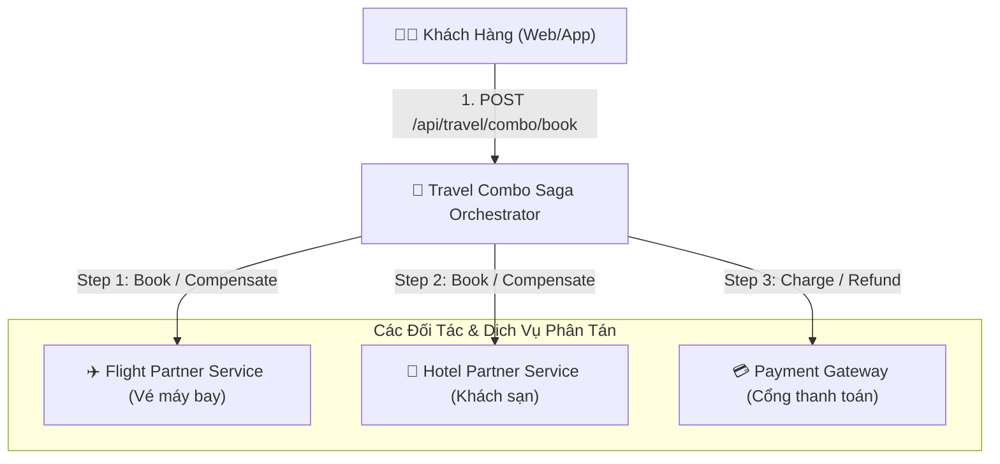
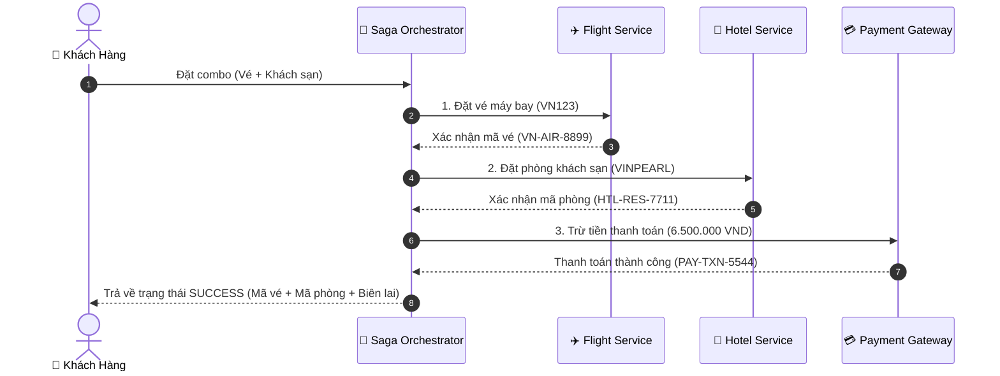
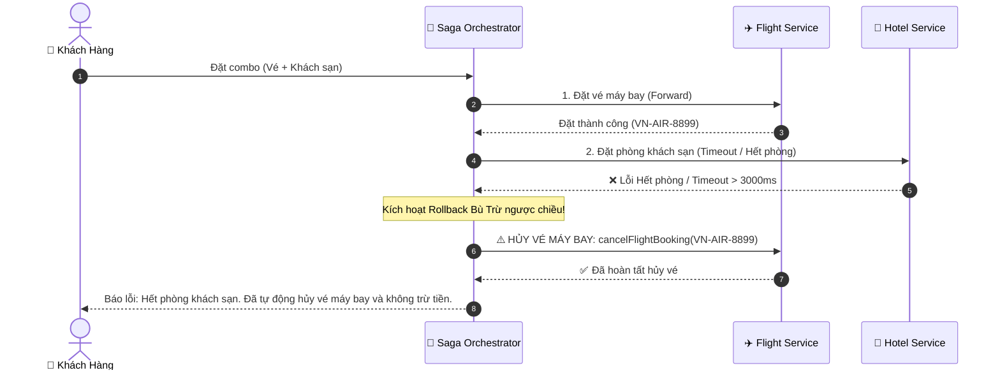
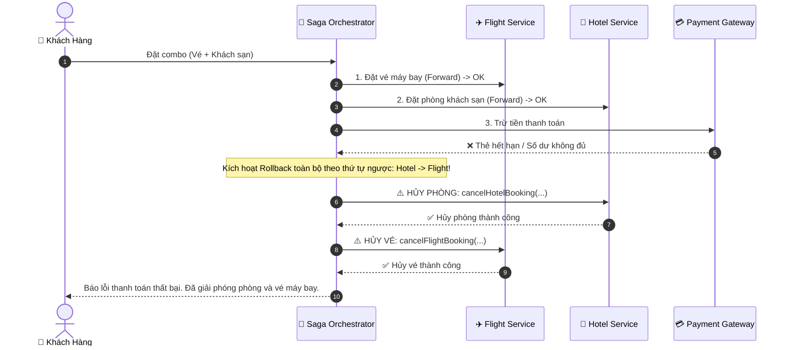

# HỒ SƠ THIẾT KẾ KIẾN TRÚC: HỆ THỐNG ĐẶT VÉ COMBO "CHUYẾN ĐI TRỌN GÓI" (SAGA PATTERN)

> **Cấp độ:** Sáng tạo (Tổng hợp kiến thức Microservices & Distributed Transactions)  
> **Dự án:** Travel Combo Booking System using Saga Orchestration  
> **Thư mục dự án:** `C:\Rikkei\microservice\ss14\b5`  
> **GitHub Repository:** [https://github.com/dinhthanh143/microservice_ss14_b5](https://github.com/dinhthanh143/microservice_ss14_b5)

---

## 1. Phân Tích Vấn Đề (Problem Analysis)

### 1.1. Bối Cảnh Nghiệp Vụ
- Khách hàng có nhu cầu đặt **Combo "Chuyến đi trọn gói"**: Bao gồm **Vé máy bay (Flight)** + **Phòng khách sạn (Hotel)** trong cùng một giao dịch thanh toán.
- **Ràng buộc nghiệp vụ sống còn (All-or-Nothing / Atomicity):** Hoặc là đặt thành công cả vé máy bay và phòng khách sạn, hoặc hủy toàn bộ giao dịch và hoàn lại 100% tiền cho khách. Tuyệt đối không để xảy ra tình trạng:
  - Khách đã đặt được vé máy bay nhưng không có phòng khách sạn để ở (phải tự hủy vé chịu phí phạt).
  - Khách bị trừ tiền nhưng một trong hai dịch vụ không được xác nhận.

### 1.2. Thách Thức Trong Hệ Thống Phân Tán
1. **Khác biệt đối tác & API:** Hệ thống Vé máy bay (Vietnam Airlines/Vietjet) và Phòng khách sạn (Vinpearl/Mường Thanh/Agoda) thuộc hai bên thứ ba độc lập, cung cấp REST API riêng biệt.
2. **Không thể dùng Transaction DB truyền thống (ACID/2PC):** Không có database chung giữa các đối tác bên ngoài. Giao thức Two-Phase Commit (2PC) vừa gây nghẽn hiệu năng (blocking), vừa không khả thi vì các đối tác không hỗ trợ interface chuẩn XA.
3. **Các điểm có thể thất bại (Points of Failure):**
   - **Hết vé / Hết phòng:** Một trong hai bên bị hết chỗ giữa chừng.
   - **Thanh toán thất bại:** Thẻ ngân hàng không đủ số dư, thẻ hết hạn, mã OTP sai.
   - **Mạng chập chờn / Timeout:** Đối tác phản hồi chậm, treo kết nối hoặc đứt kết nối mạng giữa chừng.

---

## 2. Lựa Chọn Mô Hình Saga: Orchestration vs Choreography

### 2.1. So Sánh Hai Mô Hình Saga

| Tiêu chí so sánh | Saga Choreography (Tự điều phối qua Event) | Saga Orchestration (Nhạc trưởng tập trung) | Lựa chọn tối ưu |
| :--- | :--- | :--- | :--- |
| **Cơ chế điều phối** | Các service tự nghe Event qua Message Broker (Kafka/RabbitMQ) rồi tự quyết định bước tiếp theo. | Một service trung tâm (**Saga Orchestrator**) đóng vai trò "nhạc trưởng", trực tiếp gọi và quản lý trạng thái từng bước. | **Orchestration** |
| **Độ phức tạp luồng** | Rất khó theo dõi (Spaghetti Event) khi luồng có nhiều nhánh rollback phức tạp. | Luồng giao dịch được định nghĩa rõ ràng, tập trung tại một nơi (State Machine). | **Orchestration** |
| **Phù hợp với Third-party API** | Rất khó, vì các API đối tác (Flight, Hotel, Payment) không publish/subscribe vào Kafka của ta. | Rất dễ, Orchestrator chủ động gọi REST/gRPC API sang đối tác và hứng response/timeout. | **Orchestration** |
| **Khả năng quan sát & Audit** | Phải gom log phân tán (Distributed Tracing) qua nhiều topic. | Toàn bộ lịch sử Forward / Compensating được ghi nhận tại Orchestrator. | **Orchestration** |

### 2.2. Kết luận lựa chọn
**Chọn mô hình SAGA ORCHESTRATION.**  
*Lý do:* Vì hệ thống phải tích hợp với các API đối tác bên thứ ba (Third-party REST APIs) không nằm trong cùng hạ tầng Message Broker nội bộ, và luồng nghiệp vụ yêu cầu kiểm soát chặt chẽ trạng thái giao dịch bù trừ (Compensating Transactions) theo thứ tự nghiêm ngặt.

---

## 3. Thiết Kế Kiến Trúc & Luồng Dữ Liệu

### 3.1. Sơ Đồ Khối Các Module (Architecture Diagram)



---

### 3.2. Bảng Hành Động Thuận & Giao Dịch Bù Trừ (Compensating Transactions)

| Bước (Step) | Dịch vụ (Service) | Hành động thuận (Forward Action) | Giao dịch bù trừ (Compensating Action) | Tính chất lũy đẳng (Idempotency) |
| :---: | :--- | :--- | :--- | :---: |
| **1** | **Flight Service** | `bookFlight(flightCode)` $\rightarrow$ Cấp mã vé `VN-AIR-xxx` | `cancelFlightBooking(ticketNo)` $\rightarrow$ Hủy vé máy bay | Bắt buộc (Dựa trên `ticketNo`) |
| **2** | **Hotel Service** | `bookHotel(hotelCode)` $\rightarrow$ Cấp mã phòng `HTL-RES-xxx` | `cancelHotelBooking(resNo)` $\rightarrow$ Trả phòng khách sạn | Bắt buộc (Dựa trên `resNo`) |
| **3** | **Payment Gateway** | `processPayment(amount)` $\rightarrow$ Trừ tiền thẻ khách | `refundPayment(txnId, amount)` $\rightarrow$ Hoàn tiền 100% | Bắt buộc (Dựa trên `txnId`) |

---

### 3.3. Sơ Đồ Trình Tự (Sequence Diagrams)

#### Kịch bản 1: Thành Công Toàn Bộ (Happy Path)


#### Kịch bản 2 & 4: Hotel Thất Bại hoặc Timeout $\rightarrow$ Rollback Flight


#### Kịch bản 3: Thanh Toán Thất Bại $\rightarrow$ Rollback Cả Hotel và Flight


---

## 4. Chiến Lược Xử Lý Đối Tác Phản Hồi Chậm & Lỗi Mạng

1. **Cơ Chế Timeout Chặt Chẽ:**
   - Mỗi lời gọi tới API đối tác được bọc trong ngưỡng Timeout (ví dụ: `3000ms`).
   - Nếu quá 3s đối tác không phản hồi, `Future/WebClient` chủ động ngắt kết nối và ném `TimeoutException`.
2. **Cơ Chế Retry Có Điều Kiện & Idempotency Key:**
   - Chỉ Retry với các lỗi mạng tạm thời (Transient Network Error / 503).
   - Tuyệt đối không retry các lỗi nghiệp vụ như: "Hết phòng", "Thẻ bị khóa", "Sai thông tin".
   - Mọi request gửi đi đều kèm `Idempotency-Key` (ví dụ `bookingId`) để tránh việc đối tác trừ tiền hoặc giữ chỗ 2 lần.
3. **Compensating Queue & Dead Letter Queue (DLQ):**
   - Nếu lời gọi bù trừ (hủy vé/hủy phòng) gặp trục trặc mạng, task bù trừ sẽ được đẩy vào Message Queue / Outbox Table để worker chạy ngầm retry cho tới khi thành công.

---

## 5. Hướng Dẫn Kiểm Thử Các Kịch Bản (Step-by-Step Testing)

### 5.1. Khởi động ứng dụng
```bash
./gradlew bootRun
```

### 5.2. Chạy 4 Kịch Bản Test qua cURL

#### 🔹 Kịch bản 1: Đặt combo thành công cả 3 bước (Happy Path)
```bash
curl -X POST "http://localhost:8080/api/travel/combo/book?scenario=SUCCESS"
```
*Kết quả:* `finalStatus: SUCCESS`, có đủ `flightBookingCode`, `hotelBookingCode`, `paymentTransactionId`.

#### 🔹 Kịch bản 2: Flight thành công, Hotel thất bại $\rightarrow$ Rollback Flight
```bash
curl -X POST "http://localhost:8080/api/travel/combo/book?scenario=HOTEL_FAILED"
```
*Kết quả:* `finalStatus: FAILED`, log ghi nhận bước `COMPENSATE_FLIGHT: SUCCESS` (Vé máy bay đã được tự động hủy).

#### 🔹 Kịch bản 3: Flight OK, Hotel OK, Payment thất bại $\rightarrow$ Rollback cả Hotel và Flight
```bash
curl -X POST "http://localhost:8080/api/travel/combo/book?scenario=PAYMENT_FAILED"
```
*Kết quả:* `finalStatus: FAILED`, log ghi nhận `COMPENSATE_HOTEL: SUCCESS` và `COMPENSATE_FLIGHT: SUCCESS`.

#### 🔹 Kịch bản 4: Hotel bị Timeout (>3000ms) $\rightarrow$ Ngắt và Rollback Flight
```bash
curl -X POST "http://localhost:8080/api/travel/combo/book?scenario=HOTEL_TIMEOUT"
```
*Kết quả:* Sau 3s timeout, hệ thống tự động ngắt và kích hoạt `COMPENSATE_FLIGHT: SUCCESS`.

---

## 6. Kiểm Thử Tự Động Bằng JUnit 5

Chạy toàn bộ test suite để xác minh 4 kịch bản tự phục hồi:
```bash
./gradlew test
```
Kết quả kiểm thử: **`BUILD SUCCESSFUL`** (4/4 tests passed).
